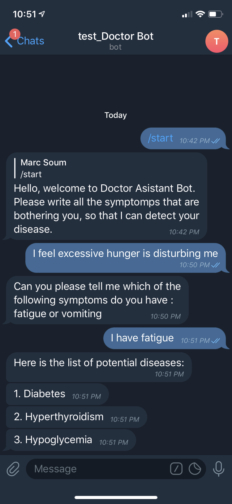

Welcome to DoctorAssistantBot!
===================

### Short project description

&nbsp;&nbsp;&nbsp;&nbsp;&nbsp;&nbsp;DoctorAssistantBot - NER (Named Entity Recognition) Telegram chatbot which can help you to determine diseases based on symptoms which you should describe.  

----------
### Structure

1. Bot.py - python file that starts bot listener.

2. data.csv - file containing all the data for the project.

3. Ner_train.ipynb - python notebook that is used to train and store NER model.

4. NER.py - python file that has the main algorithm to detect diseases.

----------
### Implementation

1. Building Telegram bot 

2. Training NER model 
	- Loading and preparing data from datasets
	- Data exploration
	- Building model
	
3. Algorithm for disease determination
	- Getting data behavior 
	- Loading model
	- Building algorithm for disease determination
 
----------
### Example

&nbsp;&nbsp;&nbsp;&nbsp;&nbsp;&nbsp;First of all we want to get symptom description from patients. With our trained NER model we are excluding entities (symptoms) from patient's sentence (plain text). Then we use data exploration (all symptoms behavior like average amount of symptoms per disease and finding top 3 most popular symptoms so we can ignore inappropriate diseases) and entities extraction to determine diseases that you are most likely experiencing.



----------
### How to run?

1. Clone repository

2. Install requirements:

	- Open project directory 

	- Open cmd in the directory

	- Run the following command 
	
	```bash 
	pip install -r requirements.txt
	``` 

3. Run the bot: 

	- Open project directory 

	- Open cmd in the directory

	- Run the following command 
	
	```bash
	python Bot.py
	``` 

4. Open Telegram and search for `@doctor123test_bot`

5. Start the bot in Telegram
